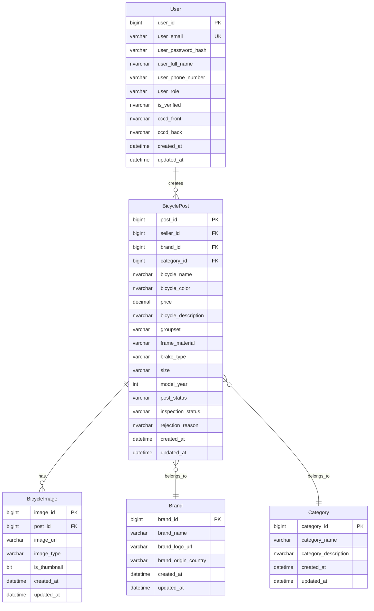

# Thiết Kế Database Entity Cho Tính Năng Đăng Bài Bán Xe Đạp Cũ

Dựa trên source code hiện có và yêu cầu của bạn, tôi đề xuất thiết kế database entity như sau.

---

## 🎨 Phân Tích UI Prototype Frontend


### So Sánh UI vs Database Design

| Mục | UI Prototype Hiện Tại | Database Design (BE) | ⚠️ Cần Thay Đổi |
|-----|----------------------|---------------------|-----------------|
| **Step 1: Basic Info** ||||
| Bike Name | ✅ Có | ✅ `bicycle_name` | ✓ Khớp |
| Brand | ✅ Dropdown | ✅ FK → `Brands` | ✓ Khớp |
| Category | ✅ Dropdown | ✅ FK → `Categories` | ✓ Khớp |
| Condition (New/Used) | ✅ Toggle | ❌ **Chưa có** | 🔧 FE bỏ hoặc BE thêm |
| **Step 2: Technical Specs** ||||
| Frame Size | ✅ Có | ✅ `size` | ✓ Khớp |
| Frame Material | ✅ Dropdown | ✅ `frame_material` | ✓ Khớp |
| Groupset | ❌ **Thiếu** | ✅ `groupset` | 🔴 FE cần thêm |
| Brake Type | ❌ **Thiếu** | ✅ `brake_type` | 🔴 FE cần thêm |
| Model Year | ❌ **Thiếu** | ✅ `model_year` | 🔴 FE cần thêm |
| Color | ❌ **Thiếu** | ✅ `bicycle_color` | 🔴 FE cần thêm |
| Description | ❌ **Thiếu** | ✅ `bicycle_description` | 🔴 FE cần thêm |
| **Step 3: Photos & Videos** ||||
| Upload area | ✅ Drag & drop | ✅ Cloudinary upload | ✓ Khớp |
| "Min 1 photo" | ✅ Chỉ yêu cầu 1 | ✅ **Yêu cầu 6 loại cụ thể** | 🔴 FE cần thay đổi lớn |
| Image types | ❌ **Không phân loại** | ✅ 6 loại bắt buộc + 1 optional | 🔴 FE cần thêm UI chọn loại ảnh |
| **Step 4: Pricing** ||||
| Sale Price | ✅ Có | ✅ `price` | ✓ Khớp (đổi sang VND) |
| Require Inspection | ✅ Toggle (optional) | ✅ **Luôn bắt buộc** | 🔧 FE bỏ toggle, mặc định bật |

---

## 📋 Feedback Cho Frontend Team

### 🔴 Thay Đổi Bắt Buộc (Critical)

#### 1. Photos & Videos - Thay đổi hoàn toàn

**Hiện tại:** Chỉ yêu cầu "Min 1 photo" với drag & drop đơn giản.

**Yêu cầu mới:** Cần 6 slot ảnh bắt buộc + 1 section ảnh lỗi (optional)

```
┌─────────────────────────────────────────────────────────────────┐
│  📷 Photos & Videos                    REQUIRED: 6 PHOTOS       │
├─────────────────────────────────────────────────────────────────┤
│                                                                 │
│  ┌─────────────┐  ┌─────────────┐  ┌─────────────┐             │
│  │ 📷          │  │ 📷          │  │ 📷          │             │
│  │             │  │             │  │             │             │  
│  │  DRIVE SIDE │  │ NON-DRIVE   │  │  COCKPIT    │             │
│  │  (Bên phải) │  │ (Bên trái)  │  │ (Tay lái)   │             │
│  │  ⭐ Required │  │  ⭐ Required │  │  ⭐ Required │             │
│  └─────────────┘  └─────────────┘  └─────────────┘             │
│                                                                 │
│  ┌─────────────┐  ┌─────────────┐  ┌─────────────┐             │
│  │ 📷          │  │ 📷          │  │ 📷          │             │
│  │             │  │             │  │             │             │
│  │ DRIVETRAIN  │  │ FRONT BRAKE │  │ REAR BRAKE  │             │
│  │  (Bộ đề)    │  │ (Phanh trước)│  │ (Phanh sau) │             │
│  │  ⭐ Required │  │  ⭐ Required │  │  ⭐ Required │             │
│  └─────────────┘  └─────────────┘  └─────────────┘             │
│                                                                 │
│  ─ ─ ─ ─ ─ ─ ─ ─ ─ ─ ─ ─ ─ ─ ─ ─ ─ ─ ─ ─ ─ ─ ─ ─ ─ ─ ─ ─ ─   │
│                                                                 │
│  📷 Defect Points (Điểm lỗi) - Optional                        │
│  ┌─────────────┐  ┌─────────────┐  ┌─────────────┐             │
│  │ ➕ Add      │  │             │  │             │             │
│  │   Photo     │  │             │  │             │             │
│  └─────────────┘  └─────────────┘  └─────────────┘             │
│  Tối đa 5 ảnh - Chụp các vết trầy, hư hỏng nếu có              │
│                                                                 │
└─────────────────────────────────────────────────────────────────┘
```

#### 2. Technical Specifications - Thêm fields

```
┌─────────────────────────────────────────────────────────────────┐
│  🔧 Technical Specifications                                    │
├─────────────────────────────────────────────────────────────────┤
│                                                                 │
│  Frame Size              Frame Material                         │
│  ┌──────────────────┐    ┌──────────────────┐                  │
│  │ e.g. 54cm, M     │    │ Carbon Fiber   ▼ │                  │
│  └──────────────────┘    └──────────────────┘                  │
│                                                                 │
│  Groupset ⭐ NEW         Brake Type ⭐ NEW                       │
│  ┌──────────────────┐    ┌──────────────────┐                  │
│  │ Shimano 105    ▼ │    │ Disc Brake     ▼ │                  │
│  └──────────────────┘    └──────────────────┘                  │
│  (Shimano 105, Ultegra,  (Rim Brake, Disc Brake)               │
│   SRAM Force, etc.)                                             │
│                                                                 │
│  Model Year ⭐ NEW       Color ⭐ NEW                            │
│  ┌──────────────────┐    ┌──────────────────┐                  │
│  │ 2023           ▼ │    │ Black/Red        │                  │
│  └──────────────────┘    └──────────────────┘                  │
│                                                                 │
│  Description ⭐ NEW                                              │
│  ┌──────────────────────────────────────────────────┐          │
│  │ Mô tả chi tiết về tình trạng xe, lịch sử sử     │          │
│  │ dụng, phụ kiện đi kèm, lý do bán...             │          │
│  │                                                  │          │
│  └──────────────────────────────────────────────────┘          │
│                                                                 │
└─────────────────────────────────────────────────────────────────┘
```

---

### 🔧 Thay Đổi Khuyến Nghị (Recommended)

#### 3. Pricing & Inspection

| Thay đổi | Chi tiết |
|----------|----------|
| **Bỏ toggle "Require Professional Inspection"** | Tất cả bài đăng đều phải qua kiểm định. Thay bằng text: "Bài đăng sẽ được kiểm định trước khi hiển thị" |
| **Đổi $ sang ₫ (VND)** | Thay `Sale Price ($)` thành `Giá bán (₫)` |
| **Thêm price formatting** | Hiển thị phân cách hàng nghìn: `15,000,000 ₫` |

#### 4. Condition Field - 2 Options

**Option A:** Bỏ field "Condition" (New/Used)
- Lý do: Sàn chuyên xe cũ, không cần phân biệt

**Option B:** BE thêm column `is_new` (BIT) vào database
- Nếu FE muốn giữ field này

> [!IMPORTANT]
> **Câu hỏi cho bạn:** Bạn muốn chọn Option A hay B?

---

### 🔵 Giữ Nguyên (No Change Needed)

| Mục | Ghi chú |
|-----|---------|
| Multi-step form flow | ✅ Giữ nguyên 4 bước |
| Brand dropdown | ✅ BE sẽ cung cấp API `/api/brands` |
| Category dropdown | ✅ BE sẽ cung cấp API `/api/categories` |
| "Save as Draft" button | ✅ Khớp với `inspection_status = PENDING` |

---

## 📊 API Endpoints Cho Frontend

```
# Master Data APIs (cho dropdowns)
GET  /api/brands              → Danh sách hãng xe
GET  /api/categories          → Danh sách loại xe

# Post Management APIs
POST /api/posts               → Tạo bài đăng mới
PUT  /api/posts/{id}          → Cập nhật bài đăng
GET  /api/posts/{id}          → Chi tiết bài đăng
GET  /api/posts               → Danh sách (có filter, pagination)
GET  /api/posts/my-posts      → Bài đăng của tôi

# Image Upload API
POST /api/upload/bicycle-image → Upload ảnh xe (trả về URL)
```

---

## Tổng Quan ERD Hiện Tại (Từ Hình Ảnh Của Bạn)


---

## Proposed Database Schema

### 1. Entity Relationship Diagram (Đề Xuất) - Phase 1

> [!NOTE]
> **Wishlist đã được chuyển sang Phase 2** theo yêu cầu của bạn.



---

### 2. Chi Tiết Các Entity

---

#### 2.1 Entity: `BicyclePost` (Bài Đăng Bán Xe)

| Column | Type | Constraint | Description |
|--------|------|------------|-------------|
| `post_id` | BIGINT | PK, IDENTITY | ID bài đăng |
| `seller_id` | BIGINT | FK → Users | Member đăng bài |
| `brand_id` | BIGINT | FK → Brands | Hãng xe |
| `category_id` | BIGINT | FK → Categories | Loại xe (Road, MTB, Gravel...) |
| `bicycle_name` | NVARCHAR(200) | NOT NULL | Tên xe |
| `bicycle_color` | NVARCHAR(50) | | Màu sắc |
| `price` | DECIMAL(18,2) | NOT NULL | Giá bán (VNĐ) |
| `bicycle_description` | NVARCHAR(MAX) | | Mô tả chi tiết |
| `groupset` | VARCHAR(100) | | Bộ truyền động (Shimano 105, Ultegra...) |
| `frame_material` | VARCHAR(50) | | Chất liệu khung (Carbon, Aluminum, Steel) |
| `brake_type` | VARCHAR(30) | | Loại phanh (Rim, Disc) |
| `size` | VARCHAR(20) | | Size khung (S, M, L, 52, 54...) |
| `model_year` | INT | | Năm sản xuất |
| `post_status` | VARCHAR(20) | CHECK constraint | **AVAILABLE / DEPOSITED / SOLD** |
| `inspection_status` | VARCHAR(20) | CHECK constraint | **PENDING / APPROVED / REJECTED** |
| `rejection_reason` | NVARCHAR(500) | | Lý do từ chối (nếu REJECTED) |
| `created_at` | DATETIME2 | DEFAULT | Thời gian tạo |
| `updated_at` | DATETIME2 | DEFAULT | Thời gian cập nhật |

**Status Flow:**

```
                                    ┌─────────────────────┐
                                    │    MEMBER tạo bài   │
                                    └──────────┬──────────┘
                                               ▼
                                    ┌─────────────────────┐
                                    │  inspection_status  │
                                    │      = PENDING      │
                                    │    post_status      │
                                    │     = AVAILABLE     │
                                    └──────────┬──────────┘
                                               ▼
                              ┌────────────────┴────────────────┐
                              ▼                                 ▼
                   ┌──────────────────┐              ┌──────────────────┐
                   │  INSPECTOR kiểm  │              │  INSPECTOR từ    │
                   │  inspection_status│             │  inspection_status│
                   │    = APPROVED    │              │    = REJECTED    │
                   └────────┬─────────┘              └──────────────────┘
                            ▼
              ┌─────────────┴─────────────┐
              ▼             ▼             ▼
     ┌──────────────┐ ┌──────────────┐ ┌──────────────┐
     │  AVAILABLE   │ │  DEPOSITED   │ │    SOLD      │
     │ (Đang bán)   │ │ (Đã đặt cọc) │ │  (Đã bán)    │
     └──────────────┘ └──────────────┘ └──────────────┘
```

---

#### 2.2 Entity: `BicycleImage` (Ảnh Xe Đạp)

| Column | Type | Constraint | Description |
|--------|------|------------|-------------|
| `image_id` | BIGINT | PK, IDENTITY | ID ảnh |
| `post_id` | BIGINT | FK → BicyclePost | Bài đăng sở hữu |
| `image_url` | VARCHAR(500) | NOT NULL | URL ảnh (Cloudinary) |
| `image_type` | VARCHAR(50) | CHECK constraint | Loại ảnh bắt buộc |
| `is_thumbnail` | BIT | DEFAULT 0 | Là ảnh đại diện? |
| `created_at` | DATETIME2 | DEFAULT | Thời gian tạo |
| `updated_at` | DATETIME2 | DEFAULT | Thời gian cập nhật |

**Image Types (Tiêu chí ảnh bắt buộc):**

| Type | Tiếng Việt | Mô Tả |
|------|------------|-------|
| `OVERALL_DRIVE_SIDE` | Toàn thân phải | Chụp toàn bộ xe từ bên phải (bên dĩa) |
| `OVERALL_NON_DRIVE_SIDE` | Toàn thân trái | Chụp toàn bộ xe từ bên trái |
| `COCKPIT_AREA` | Tay lái | Chụp khu vực tay lái, ghi đông |
| `DRIVETRAIN_CLOSEUP` | Bộ đề | Chụp cận cảnh bộ truyền động |
| `FRONT_BRAKE` | Phanh trước | Chụp cận cảnh phanh trước |
| `REAR_BRAKE` | Phanh sau | Chụp cận cảnh phanh sau |
| `DEFECT_POINT` | Điểm lỗi | Chụp các điểm hư hỏng, trầy xước (nếu có) |

> [!TIP]
> **Validation Logic:** Khi member tạo bài, backend cần kiểm tra đủ 6 loại ảnh bắt buộc (trừ `DEFECT_POINT` là optional). Nếu thiếu, trả về lỗi kèm danh sách ảnh còn thiếu.

---

#### 2.3 Entity: `Brand` (Hãng Xe)

| Column | Type | Constraint | Description |
|--------|------|------------|-------------|
| `brand_id` | BIGINT | PK, IDENTITY | ID hãng |
| `brand_name` | VARCHAR(100) | NOT NULL, UNIQUE | Tên hãng (Giant, Trek, Specialized...) |
| `brand_logo_url` | VARCHAR(500) | | URL logo hãng |
| `brand_origin_country` | VARCHAR(100) | | Quốc gia xuất xứ |
| `created_at` | DATETIME2 | DEFAULT | |
| `updated_at` | DATETIME2 | DEFAULT | |

---

#### 2.4 Entity: `Category` (Loại Xe)

| Column | Type | Constraint | Description |
|--------|------|------------|-------------|
| `category_id` | BIGINT | PK, IDENTITY | ID loại |
| `category_name` | VARCHAR(100) | NOT NULL, UNIQUE | Tên loại (Road Bike, MTB, Gravel...) |
| `category_description` | NVARCHAR(500) | | Mô tả loại xe |
| `created_at` | DATETIME2 | DEFAULT | |
| `updated_at` | DATETIME2 | DEFAULT | |

---

## Proposed Changes - Phase 1 (Files Cần Tạo/Sửa)

> [!NOTE]
> **Wishlist sẽ được implement ở Phase 2**

### Enums (Thư mục: `enums/`)

#### [NEW] [PostStatusEnum.java](file:///c:/Users/xuhoa/Downloads/bike-platform/src/main/java/com/swp391/bike_platform/enums/PostStatusEnum.java)
```java
public enum PostStatusEnum {
    AVAILABLE,   // Đang bán
    DEPOSITED,   // Đã đặt cọc
    SOLD         // Đã bán
}
```

#### [NEW] [InspectionStatusEnum.java](file:///c:/Users/xuhoa/Downloads/bike-platform/src/main/java/com/swp391/bike_platform/enums/InspectionStatusEnum.java)
```java
public enum InspectionStatusEnum {
    PENDING,     // Chờ kiểm định
    APPROVED,    // Đã duyệt
    REJECTED     // Từ chối
}
```

#### [NEW] [ImageTypeEnum.java](file:///c:/Users/xuhoa/Downloads/bike-platform/src/main/java/com/swp391/bike_platform/enums/ImageTypeEnum.java)
```java
public enum ImageTypeEnum {
    OVERALL_DRIVE_SIDE,      // Toàn thân phải
    OVERALL_NON_DRIVE_SIDE,  // Toàn thân trái
    COCKPIT_AREA,            // Tay lái
    DRIVETRAIN_CLOSEUP,      // Bộ đề
    FRONT_BRAKE,             // Phanh trước
    REAR_BRAKE,              // Phanh sau
    DEFECT_POINT             // Điểm lỗi (optional)
}
```

---

### Entities (Thư mục: `entity/`)

#### [NEW] [Brand.java](file:///c:/Users/xuhoa/Downloads/bike-platform/src/main/java/com/swp391/bike_platform/entity/Brand.java)
#### [NEW] [Category.java](file:///c:/Users/xuhoa/Downloads/bike-platform/src/main/java/com/swp391/bike_platform/entity/Category.java)
#### [NEW] [BicyclePost.java](file:///c:/Users/xuhoa/Downloads/bike-platform/src/main/java/com/swp391/bike_platform/entity/BicyclePost.java)
#### [NEW] [BicycleImage.java](file:///c:/Users/xuhoa/Downloads/bike-platform/src/main/java/com/swp391/bike_platform/entity/BicycleImage.java)

---

### Repositories (Thư mục: `repository/`)

#### [NEW] [BrandRepository.java](file:///c:/Users/xuhoa/Downloads/bike-platform/src/main/java/com/swp391/bike_platform/repository/BrandRepository.java)
#### [NEW] [CategoryRepository.java](file:///c:/Users/xuhoa/Downloads/bike-platform/src/main/java/com/swp391/bike_platform/repository/CategoryRepository.java)
#### [NEW] [BicyclePostRepository.java](file:///c:/Users/xuhoa/Downloads/bike-platform/src/main/java/com/swp391/bike_platform/repository/BicyclePostRepository.java)
#### [NEW] [BicycleImageRepository.java](file:///c:/Users/xuhoa/Downloads/bike-platform/src/main/java/com/swp391/bike_platform/repository/BicycleImageRepository.java)

---

### DTOs

#### Request DTOs (Thư mục: `request/`)
- [NEW] `CreateBicyclePostRequest.java` - Request tạo bài đăng
- [NEW] `UpdateBicyclePostRequest.java` - Request cập nhật bài đăng
- [NEW] `UpdatePostStatusRequest.java` - Request thay đổi trạng thái (DEPOSITED/SOLD)
- [NEW] `InspectionDecisionRequest.java` - Request kiểm định (APPROVED/REJECTED)

#### Response DTOs (Thư mục: `response/`)
- [NEW] `BicyclePostResponse.java` - Response bài đăng
- [NEW] `BicyclePostListResponse.java` - Response danh sách bài đăng (pagination)
- [NEW] `BrandResponse.java` - Response thông tin hãng
- [NEW] `CategoryResponse.java` - Response thông tin loại xe

---

### Services (Thư mục: `service/`)

#### [NEW] [BicyclePostService.java](file:///c:/Users/xuhoa/Downloads/bike-platform/src/main/java/com/swp391/bike_platform/service/BicyclePostService.java)
- `createPost(CreateBicyclePostRequest, userId)` - Tạo bài đăng mới
- `updatePost(postId, UpdateBicyclePostRequest, userId)` - Cập nhật bài đăng
- `getPostById(postId)` - Lấy chi tiết bài đăng
- `getAllPosts(pageable, filters)` - Lấy danh sách có phân trang
- `getMyPosts(userId, pageable)` - Lấy bài đăng của member
- `updatePostStatus(postId, status, userId)` - Cập nhật DEPOSITED/SOLD
- `deletePost(postId, userId)` - Xóa bài đăng

#### [NEW] [InspectionService.java](file:///c:/Users/xuhoa/Downloads/bike-platform/src/main/java/com/swp391/bike_platform/service/InspectionService.java)
- `getPendingPosts(pageable)` - Lấy các bài chờ kiểm định (cho Inspector)
- `approvePost(postId, inspectorId)` - Duyệt bài đăng
- `rejectPost(postId, inspectorId, reason)` - Từ chối bài đăng

#### [NEW] [BrandService.java](file:///c:/Users/xuhoa/Downloads/bike-platform/src/main/java/com/swp391/bike_platform/service/BrandService.java)
- `getAllBrands()` - Lấy danh sách hãng xe cho dropdown

#### [NEW] [CategoryService.java](file:///c:/Users/xuhoa/Downloads/bike-platform/src/main/java/com/swp391/bike_platform/service/CategoryService.java)
- `getAllCategories()` - Lấy danh sách loại xe cho dropdown

---

### Controllers (Thư mục: `controller/`)

#### [NEW] [BicyclePostController.java](file:///c:/Users/xuhoa/Downloads/bike-platform/src/main/java/com/swp391/bike_platform/controller/user/BicyclePostController.java)
- `POST /api/posts` - Tạo bài đăng (MEMBER)
- `PUT /api/posts/{id}` - Cập nhật bài đăng (MEMBER - chủ bài)
- `GET /api/posts/{id}` - Xem chi tiết bài đăng (PUBLIC)
- `GET /api/posts` - Danh sách bài đăng (PUBLIC)
- `GET /api/posts/my-posts` - Bài đăng của tôi (MEMBER)
- `PUT /api/posts/{id}/status` - Đổi trạng thái (MEMBER - chủ bài)
- `DELETE /api/posts/{id}` - Xóa bài đăng (MEMBER - chủ bài)

#### [NEW] [InspectionController.java](file:///c:/Users/xuhoa/Downloads/bike-platform/src/main/java/com/swp391/bike_platform/controller/inspector/InspectionController.java)
- `GET /api/inspection/pending` - Danh sách bài chờ duyệt (INSPECTOR)
- `PUT /api/inspection/{id}/approve` - Duyệt bài (INSPECTOR)
- `PUT /api/inspection/{id}/reject` - Từ chối bài (INSPECTOR)

#### [NEW] [BrandController.java](file:///c:/Users/xuhoa/Downloads/bike-platform/src/main/java/com/swp391/bike_platform/controller/BrandController.java)
- `GET /api/brands` - Danh sách hãng xe (PUBLIC - cho dropdown)

#### [NEW] [CategoryController.java](file:///c:/Users/xuhoa/Downloads/bike-platform/src/main/java/com/swp391/bike_platform/controller/CategoryController.java)
- `GET /api/categories` - Danh sách loại xe (PUBLIC - cho dropdown)

---

### Database Script

#### [MODIFY] [database_setup.sql](file:///c:/Users/xuhoa/Downloads/bike-platform/database_setup.sql)
Thêm các bảng mới: `Brands`, `Categories`, `BicyclePosts`, `BicycleImages`

---

## Phase 2 - Wishlist Feature (Sau khi Phase 1 hoàn thành)

- [ ] Entity: `Wishlist`
- [ ] Repository: `WishlistRepository`
- [ ] Service: `WishlistService`
- [ ] Controller: `WishlistController`
  - `POST /api/wishlist/{postId}` - Thêm vào yêu thích
  - `DELETE /api/wishlist/{postId}` - Xóa khỏi yêu thích
  - `GET /api/wishlist` - Danh sách yêu thích của tôi

---

## Verification Plan

### Automated Tests
1. Unit tests cho `BicyclePostService`:
   - Tạo bài đăng thành công với đủ ảnh
   - Validate thiếu ảnh bắt buộc → lỗi
   - Cập nhật trạng thái từ AVAILABLE → DEPOSITED → SOLD

2. Integration tests cho API endpoints:
   - Test flow: Tạo bài → Kiểm định → Duyệt/Từ chối
   - Test authorization (MEMBER vs INSPECTOR roles)

### Manual Verification
1. Sử dụng Postman để test các API
2. Kiểm tra database sau mỗi thao tác
