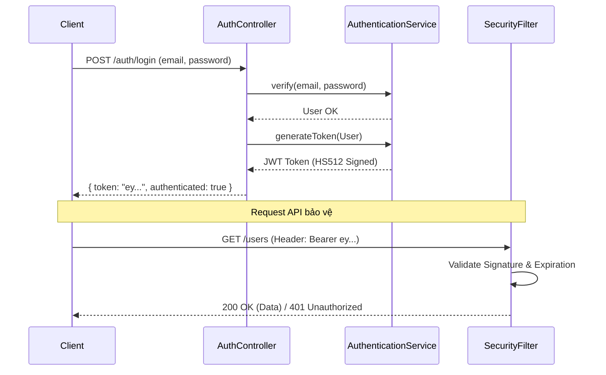

# 📘 Bike Platform - Comprehensive Developer Documentation

Tài liệu kỹ thuật chi tiết dành cho Developer. Tài liệu này mô tả toàn bộ kiến trúc, cơ sở dữ liệu, quy trình bảo mật và chi tiết từng API Endpoint.

---

## 1. 🏗️ Architecture Overview

Dự án được xây dựng theo kiến trúc **Layered Architecture** điển hình của Spring Boot:

- **Presentation Layer (`controller`)**: Tiếp nhận REST API request, validate dữ liệu đầu vào.
- **Service Layer (`service`)**: Chứa logic nghiệp vụ chính (Business Logic), transaction management.
- **Data Access Layer (`repository`)**: Giao tiếp trực tiếp với database thông qua Spring Data JPA (Hibernate).
- **Domain Molder (`entity`)**: Đại diện cho các bảng trong SQL Server.
- **DTO (`request`, `response`)**: Object dùng để chuyển dữ liệu giữa client và server (tránh lộ Entity trực tiếp).

### 🛠️ Technology Stack
- **Lang**: Java 17
- **Fw**: Spring Boot 3.2.0
- **DB**: SQL Server 2019+
- **Auth**: JWT (Nimbus JOSE + OAuth2 Resource Server)
- **External**: ImgBB API (Image Hosting)

---

## 2. �️ Database Schema (`Users` Table)

Bảng người dùng chính của hệ thống.

| Column Name | Data Type | Constraints | Description |
|-------------|-----------|-------------|-------------|
| `user_id` | `BIGINT` | PK, Identity | ID tự tăng |
| `user_email` | `VARCHAR(255)` | Unique, Not Null | Email đăng nhập |
| `user_password_hash` | `VARCHAR(255)` | Not Null | Password đã mã hóa (BCrypt) |
| `user_full_name` | `NVARCHAR(100)`| Not Null | Họ tên hiển thị |
| `user_phone_number` | `VARCHAR(15)` | Nullable | Số điện thoại |
| `user_role` | `VARCHAR(255)` | Enum | `MEMBER`, `ADMIN`, `INSPECTOR` |
| `cccd_front` | `NVARCHAR(MAX)`| Nullable | Link ảnh mặt trước CCCD |
| `cccd_back` | `NVARCHAR(MAX)`| Nullable | Link ảnh mặt sau CCCD |
| `is_verified` | `VARCHAR(20)` | Default 'PENDING'| Trạng thái xác thực (`PENDING`, `VERIFIED`, `REJECTED`) |
| `created_at` | `DATETIME` | Auto | Thời gian tạo |
| `updated_at` | `DATETIME` | Auto | Thời gian cập nhật cuối |

---

## 3. 🔐 Security & Authentication Flow

Hệ thống sử dụng **Stateless JWT Authentication**. Không dùng Session.



---

## 4. 🔌 API Reference Detail

### A. Authentication Group (`/auth`)
*Không yêu cầu Token.*

#### 1. Register New User
- **Endpoint**: `POST /auth/register`
- **Content-Type**: `multipart/form-data`
- **Request Body**:
  - `email` (text): Email người dùng
  - `password` (text): Mật khẩu
  - `fullName` (text): Họ và tên
  - `phoneNumber` (text): Số điện thoại
  - `cccdFront` (file): Ảnh mặt trước CCCD
  - `cccdBack` (file): Ảnh mặt sau CCCD
- **Response Success (200)**:
  ```json
  {
      "code": 1000,
      "result": {
          "userId": 1,
          "email": "user@example.com",
          "fullName": "Nguyen Van A",
          "role": "MEMBER",
          "isVerified": "PENDING",
          ...
      }
  }
  ```

#### 2. Login
- **Endpoint**: `POST /auth/login`
- **Content-Type**: `application/json`
- **Request Body**:
  ```json
  {
      "email": "user@example.com",
      "password": "password123"
  }
  ```
- **Response Success (200)**:
  ```json
  {
      "code": 1000,
      "result": {
          "token": "eyJhbGciOiJIUzUxMiJ9...",
          "authenticated": true
      }
  }
  ```

---

### B. User Management Group (`/users`)
🔒 *Yêu cầu Header:* `Authorization: Bearer <token>`

#### 1. Get All Users
- **Endpoint**: `GET /users`
- **Description**: Lấy danh sách toàn bộ user.
- **Response**: Array of User Response.

#### 2. Get User Detail
- **Endpoint**: `GET /users/{id}`
- **Param**: `id` (Long) - ID user cần lấy.
- **Response**: Object User Response.

#### 3. Update User Info
- **Endpoint**: `PUT /users/{id}`
- **Content-Type**: `application/json`
- **Request Body**: (Các trường muốn update, nếu không update thì null)
  ```json
  {
      "fullName": "Ten Moi",
      "phoneNumber": "0999888777",
      "address": "Dia chi moi"
  }
  ```
- **Response**: User Response sau khi update.

#### 4. Delete User
- **Endpoint**: `DELETE /users/{id}`
- **Response**: String message "User has been deleted".

---

### C. Utilities Group (`/api`)

#### 1. Upload Image (ImgBB)
- **Endpoint**: `POST /api/upload/image`
- **Content-Type**: `multipart/form-data`
- **Request**:
  - `image` (file): File ảnh cần upload.
- **Response**: URL string trực tiếp của ảnh trên ImgBB.

---

## 5. � Common Error Codes

| Code | Message | HTTP Status | Meaning |
|------|---------|-------------|---------|
| 1000 | (Success) | 200 | Thành công |
| 1002 | User existed | 400 | Email này đã được đăng ký |
| 1005 | User not existed | 404 | Không tìm thấy User ID/Email |
| 1006 | Unauthenticated | 401 | Sai password hoặc chưa đăng nhập |
| 1008 | Token is invalid | 401 | Token sai định dạng/chữ ký |
| 1009 | Token has expired | 401 | Token hết hạn sử dụng |
